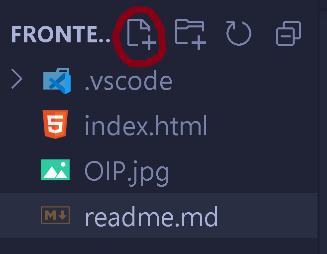
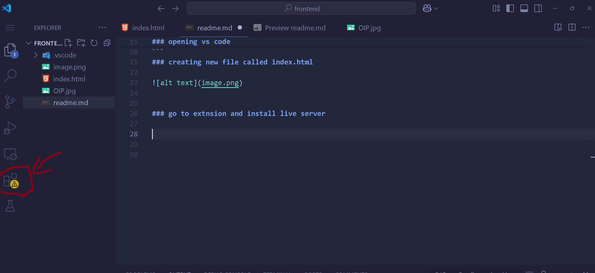
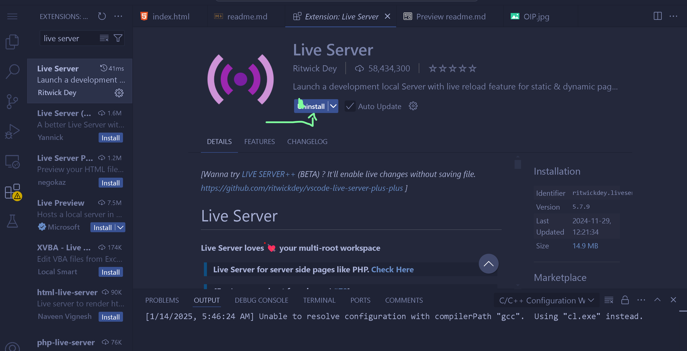
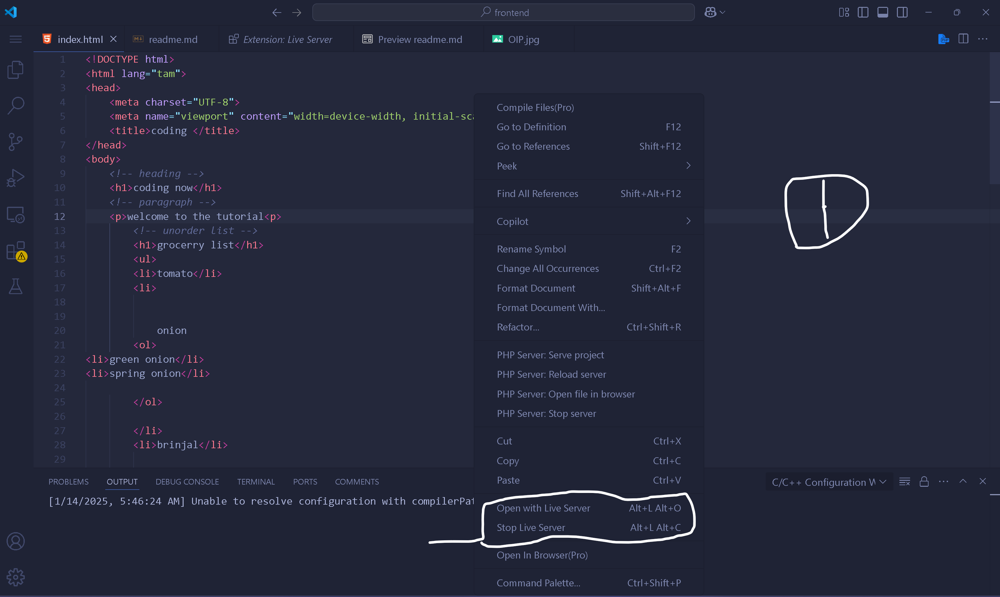

### open cmd


### linux cmd commands
``` # making a directory
mkdir <directory name> 
```

### navigating to the directory
``` 
cd <directory name>
```
### tips press tab to complete full letter

### opening vs code

```
code .

```
### creating new file called index.html




### go to extnsion and install live server




### type live server and install it





### open index.html and go inside code right click and open live server




### index will be runned

### html attributes eg lang


``` html

<html lang="eng"></html>

```
### h1 example
```html

 <h1>coding now</h1>
 <h2>coding now</h2>
  <h3>coding now</h3>
 <h4>coding now</h5>
 <h5>coding now</h5>
 <h6>coding now</h6>
 


```

### p tag eg:
``` html
<P>hi vijay</p>

```


### ul unorder list


``` html

<ul>
        <li>tomato</li>
        <li>onion</li>
        <li>brinjal</li>
</ul>

```

### order list <ol>


``` html

<ol type="a" start="1">
<li>cycling</li>
<li>reels</li>
<li>cinema</li>
</ol>


```


### table eg

``` html

<table 
         cellpadding="12px"
         cellspacing="12px" border="solid 1px black">
            <tr>
           <td colspan="2">student name</td>
           <td>dob</td>
           <!-- <td>marks</td> -->


            </tr>
            <tr >
                <td rowspan="2">vijay</td>
                <td>25/11/1999</td>
                <td>100</td>
            </tr>
            <tr>
                
                <td>25/11/1999</td>
                <td>100</td>
            </tr>
         </table>

```

### img tag


``` html

 


 ```


 ### video tag


 ``` html

 <video src="vijay.mp4" controls>


 ```
